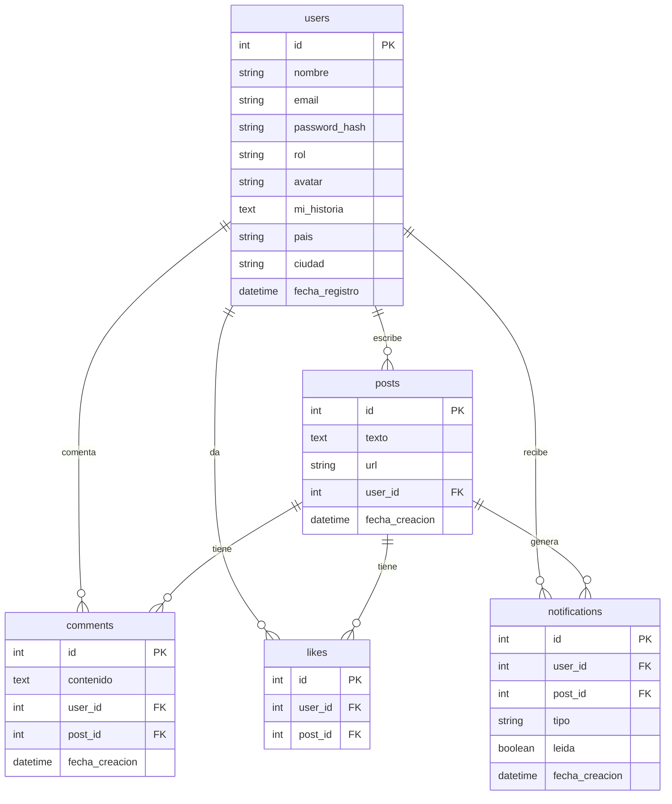

# Diagrama de Base de Datos — Bloom 🌸

## Relaciones

- User tiene muchos Posts
- User tiene muchos Comments
- User tiene muchos Likes
- User tiene muchas Notifications
- Post tiene muchos Comments
- Post tiene muchos Likes
- Post tiene muchas Notifications

## Diagrama

